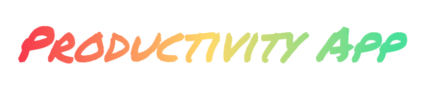



The Productivity App helps you list and track your todos completed or uncompleted.

You can see see how many todos you've completed today, how many todos on average you've completed daily and also the percentage difference between those 2 number to know if you are ahead of your average or falling behind.

 <h2>Desktop</h2>
 

  <h2>Mobile</h2>
 

## Credentials:

- email: demo_user@gmail.com
- password: Testpass1!

## Usage

### Authentication

You can use the above credentials or create an account to use the app or use . When you see the login form click on 'CREATE ACCOUNT' to be redirected to the register form. There you can fill in your credentials. Once you've successfully registered a user you can use those credentials on the login form to gain access.

### Adding Todos

In order to add todos simply write a todo task on the input field and click 'Add Todo' button or hit the ENTER key.

**Note:**
_Todos cannot contain less than 3 characters or more than 40 characters in length._

### Editing Todos

In order to edit todos simply click on a specific todo's text and the displayed text will become an input element where you can edit the todo text.

### Deleting Todos

In order to delete a todo simply clicking on the ❌ icon on the specific todo you want to delete and this will dissapear.

### Marking Todo as Complete

In order to mark a todo as complete simply click on the specific todo's ✅ icon to mark the todo as complete.

### Checking Todo Statistics

The todo statistics can be seen on top of the todo input and list (on desktop views) and beneath the todo list (on mobile views). This is so that when checking the
app on mobile the first thing the user sees is the todo input and list.

The statistics displayed are:

- Todos completed today.
- Average of todos completed daily.
- Percentage difference between the previous 2 numbers.

## ⚠️ Under Construction Features⚠️

- Todo drag and drop functionality
- Daily Section
- Learnings Section

## Known issues:

- When creating todos with the same text ('Feed the cats') and then proceeding to delete them by clicking on the 'X' button, after clicking 'X' instead of only the selected todo disappearing, all the preceeding todos with the same text disappear, and then if the user reloads the page the preceeding todos are displayed again.

## Installation & Running App

For installing the Django application clone the repository and cd inside the directory

    cd productivity-app

### Installation - Front-end

For installing the front-end cd to the front-end folder:

    cd front-end

And run:

    npm install

### Running app - Front-end

For running the front-end cd to the front-end folder and run:

    npm start

### Installation - Back-end

For installing the back-end cd to the back-end folder:

    cd back-end

And run:

    npm install

### Running app - Back-end

For running the back-end cd to the back-end folder and run:

    npm start

## Installation - Cypress

**Note:**
_Already installed if you installed front-end. Cypress folder is located in front-end/cypress. Therefore when installing the packages of the front-end's folder package.json the cypress packages are installed too._

## Tests

| Type           | Location                                                                       |
| -------------- | ------------------------------------------------------------------------------ |
| api            | [front-end/cypress/e2e/api/](front-end/cypress/e2e/api/)                       |
| component      | [front-end/cypress/component/](front-end/cypress/component/)                   |
| functional     | [front-end/cypress/e2e/](front-end/cypress/e2e/functional/)                    |
| responsiveness | [front-end/cypress/e2e/responsiveness/](front-end/cypress/e2e/responsiveness/) |
| smoke          | [front-end/cypress/e2e/smoke/](front-end/cypress/e2e/smoke/)                   |

## Running tests

### E2E tests

For opening cypress client cd to the front-end folder:

    cd front-end/

And run:

    npx cypress open

Or if running from the CLI use one of the scripts found in package.json:

```
'test:chrome': 'cypress run --browser chrome',
'test:firefox': 'cypress run --browser firefox',
'test:edge': 'cypress run --browser edge',
'test:electron': 'cypress run --browser electron',
'test:all-browsers': 'npm run test:chrome && npm run test:firefox && npm run test:edge && npm run test:electron',
'test:api': 'cypress run --spec 'cypress/e2e/api/'',
'test:functional': 'cypress run --spec 'cypress/e2e/functional/'',
'test:responsiveness': 'cypress run --spec 'cypress/e2e/responsiveness/'',
'test:smoke': 'cypress run --spec 'cypress/e2e/smoke/'',
```

## Uses

- Bootstrap
- React
- Chart.js
- TypeScript
- Cypress
- Node
- Express

## Features

- Todo Statistics
- Todo List
- Todo Filtering by Tabs
- Todo Editing and Deletion
